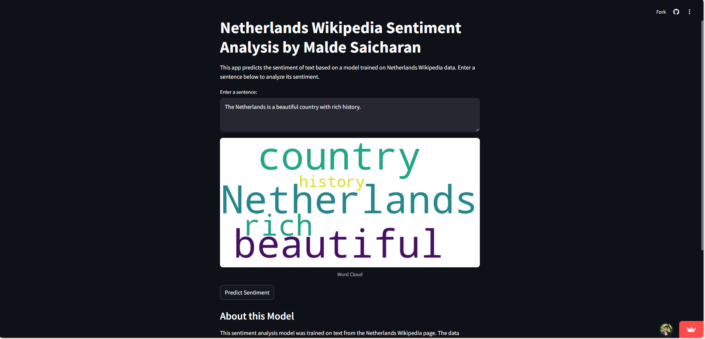

# Netherlands Wikipedia Sentiment Analysis 🌍📊  

## Overview  
This project implements a sentiment analysis system for content extracted from the Netherlands Wikipedia page. It covers the complete data science pipeline, from web scraping and text preprocessing to model training and deployment via a **Streamlit web application**.  

## 🚀 Features  
✔ Web scraping using **BeautifulSoup**  
✔ Sentiment analysis using **TextBlob & Machine Learning models**  
✔ Interactive **Streamlit** web app for real-time predictions  
✔ Exploratory Data Analysis (EDA) with **word clouds & sentiment distribution**  
✔ **TF-IDF Vectorization** for feature extraction  
✔ **SMOTE** for handling class imbalance  
✔ Comparison of **six different ML models**  

## 🛠 Tech Stack  
- **Python** (Core language)  
- **Streamlit** (Web app framework)  
- **Scikit-learn** (ML model training)  
- **Pandas & NumPy** (Data manipulation)  
- **NLTK** (Text preprocessing)  
- **Pickle** (Model storage & retrieval)  

## 📊 Data Collection & Preprocessing  
- Scraped **Netherlands Wikipedia** page content  
- Removed citations, special characters & whitespace  
- Tokenized sentences & words, removing stopwords  

## 🔬 Exploratory Data Analysis  
- **Sentiment Distribution Analysis** (Positive, Negative, Neutral)  
- **Word Frequency Analysis** (Most common words)  
- **Word Cloud Visualization**  

## 🤖 Machine Learning Models  
| Model                | Accuracy  |  
|----------------------|-----------|  
| Logistic Regression  | 90.20%  |  
| Random Forest       | 90.20%  |  
| Gradient Boosting   | 88.54%  |  
| Decision Tree       | 74.51%  |  
| Naïve Bayes        | 78.43%  |  
| K-Nearest Neighbors | 9.80%   |  

**🏆 Selected Model:** *Logistic Regression (Best Performance: 90.2% Accuracy)*  

## 📡 Deployment  
The project is deployed as a **Streamlit Web App**, allowing users to input text and get sentiment predictions along with confidence scores.  

🔗 **Live Demo**: [Streamlit App](https://netherlands-wikipedia-sentimental-analysis.streamlit.app/)  

🔗 **GitHub Repo**: [GitHub Project](https://github.com/saicharan0623/Netherlands-wikipedia-sentimental-analysis)  

## 📈 Future Enhancements  
- **Optimize sentiment classification thresholds**  
- **Expand feature engineering (n-grams, POS tags, entity recognition)**  
- **Implement explainability techniques (SHAP, LIME)**  
- **Cross-validation for robust performance metrics**  
- **Error analysis for improving misclassified results**  

## 💡 Conclusion  
This project successfully develops a **sentiment analysis system** tailored for Netherlands-related content. The **Streamlit app** provides an accessible and practical interface for users to analyze sentiments in real time.  

📌 *Developed by [Malde Saicharan](https://github.com/saicharan0623) at SVKM’s NMIMS Hyderabad under Prof. Rajesh Prabhakar.*  

---

🔹 *Feel free to contribute, raise issues, or fork this repository!* 🚀
